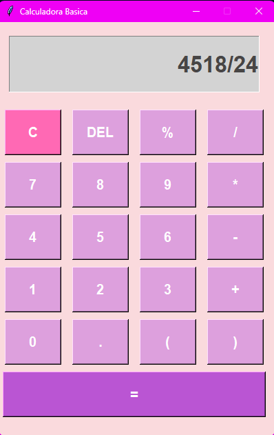

# 🧮 Calculadora Básica - Interfaz Gráfica

Esta aplicación es una calculadora funcional desarrollada en **Python** utilizando la librería **Tkinter** para el diseño de la interfaz de usuario (GUI).

### 🛠️ Características Técnicas
* **Interfaz Personalizada**: Diseño con colores estéticos y tipografía **Roboto**.
* **Manejo de Operaciones**: Utiliza la función `eval()` para procesar cadenas de texto matemáticas.
* **Control de Errores**: Implementación de bloques `try/except` para gestionar operaciones inválidas (como divisiones por cero) y mostrar "Error" en pantalla.
* **Funciones Especiales**: 
    * Soporte para cálculo de porcentajes.
    * Botón de borrado simple (`DEL`) y limpieza total (`C`).
    * Uso de paréntesis para jerarquía de operaciones.

### 📸 Vista Previa

