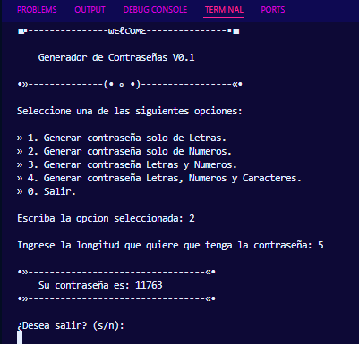
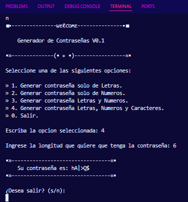

# 🔐 Generador de Contraseñas Seguras (V0.1)

Este es un script de Python diseñado para generar contraseñas aleatorias altamente seguras, permitiendo al usuario elegir la complejidad y longitud de la clave.

### 🛠️ Características Técnicas
* **Seguridad Criptográfica**: Utiliza la librería `secrets` de Python, que es más segura que `random` para aplicaciones de seguridad y contraseñas.
* **Personalización**: Permite elegir entre 4 niveles de complejidad:
    1. Solo letras.
    2. Solo números.
    3. Combinación de letras y números.
    4. Combinación total (letras, números y caracteres especiales).
* **Diccionario Dinámico**: Gestión organizada de caracteres mediante el uso de la librería `string` y diccionarios de Python.
* **Interfaz Estética**: Menú personalizado por consola con diseño visual para una mejor experiencia de usuario.

### 📸 Vista Previa
![Captura del Generador de Contraseñas]

