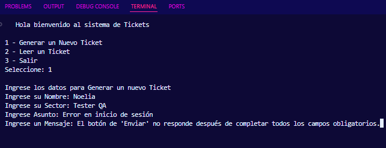
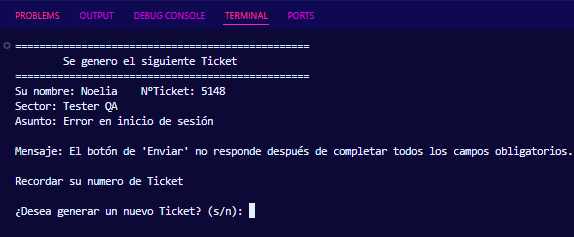

# 🎫 Sistema de Generación de Tickets (Enfoque QA)

Este proyecto simula un sistema de soporte técnico para la gestión de incidentes. Permite la creación, almacenamiento y lectura de tickets de error, diseñado con un enfoque profesional para el área de **Quality Assurance (QA)**.

### 🛠️ Características Técnicas
* **Persistencia de Datos**: Utiliza la librería 'pickle' para serializar objetos y guardarlos en archivos `.pkl`.
* **Manejo de Archivos**: Incluye validaciones para asegurar que los tickets existan antes de ser consultados.
* **Generación Aleatoria**: Asigna un ID único a cada reporte para su seguimiento.
* **Interfaz de Consola**: Menú interactivo con limpieza de pantalla para una mejor experiencia de usuario.

---

### 📸 Proceso de Testing QA

#### 📋 1. Registro del Incidente
Se ingresan los datos del error detectado, incluyendo el sector y un mensaje descriptivo de la falla encontrada.

#### 🔍 2. Verificación del Ticket Generado
El sistema confirma la creación exitosa y muestra el resumen del ticket con su número de referencia para futuras consultas.

---

### 🧪 Relevancia para QA
Este sistema permite documentar hallazgos de manera estructurada:
1. **Asunto**: "Error en inicio de sesión".
2. **Mensaje**: Descripción técnica del comportamiento esperado vs. el real ("El botón de 'Enviar' no responde...").